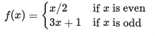

 

# Assessment Repository

by Andrea Cignoni

***

# Part 1 : Tasks

## Task 1: Collatz Conjecture Verification

### Overview

The *Collatz conjecture* is a famous unsolved problem in mathematics stating that a defined function applied to any positive integer **x** will always lead to the repeating sequence $1, 4, 2, 1, 4, 2,1, 2, 3,\ldots$

### Function Definition

The function $f(x)$ is defined as follows:

### Example

For instance, starting with an even number, as for instance 10, we divide it by 2 to get 5. Then, as 5 is odd, we multiply by 3 and add 1 to get 16. The same calculation is then repeated dividing by 2 results in the sequence 8, 4, 2, 1. Once at 1, the sequence becomes 4, 2, 1 in a loop.

### Task Requirement

My task was to verify, using Python, that the *Collatz conjecture* holds true for the first 10,000 positive integers.

### Code devolepment

In order to prove that the *Collatz conjecture* to be true, I have first defined a function *f(x)* implementing the mathematical calculation, then I have created the format how this same function operates in a variable named *collatz()* and, finally, I have encapsulated the iterative process within a loop using a another variable to prove the conjecture's validity for the first 100,000 positive integers.

## Task 2: Overview of the Famous Penguins Dataset

### Overview

The **Famous Penguins dataset** is a well-known dataset often used in data science and machine learning. It contains information about various penguin species, providing a basis for exploring and understanding the characteristics of these aquatic birds. The raw cvs file was  is downloaded from [mwaskom/seaborn-data Github](https://github.com/mwaskom/) and read using Pandas' **pd.read_csv()** method.

### Dataset Description

The dataset typically includes the following variables:

- **Species**: The species of the penguin: *Adelie*, *Chinstrap*, *Gentoo*.
+ **Island**: The islands where the penguins were observed: *Biscoe*, *Dream*, *Torgersen*.
* **Bill Length (mm)**: The length of the penguin's bill in millimetres.
- **Bill Depth (mm)**: The depth of the penguin's bill in millimetres.
+ **Flipper Length (mm)**: The length of the penguin's flipper in millimetres.
* **Body Mass (g)**: The body mass of the penguin in grams.
- **Sex**: The gender of the penguin: *male* and *female*.

### Variable Types

1. **Categorical Variables**

The dataset contains three categorical variables that are *species*, *islands* and *sex* where the first two can be considered as *nominal categorical variables* and the latter  a *nominal variable of the dichotomous type*.

2. **Continuous Variables**

*Bill Length (mm)*, *Bill Depth (mm)*, *Flipper Length (mm)*, *Body Mass (g)* are all continuous variables representing physical characteristics of the penguins. In the data set description, rhey were analysed using Pandas' **describe()** function to provide summary statistics.

## Task 3: Probability Distribution Modeling for Penguins Dataset Variables

### Overview

In Task 3, the assignment consists in selecting an appropriate probability distribution from the **NumPy random distributions list** for modeling each variable in the Famous Penguins dataset.

### Variable and Probability Distributions chosen

- Species and Island:
The **Multinomial distribution** is suitable for the categorical variables *Species* and *Island,* capturing the probability distribution across multiple categories. 
+ Sex:
The **Binomial distribution** is chosen for the categorical variable *Sex,* which represents a binary outcome.
* Bill Length, Bill Depth, Flipper Length:
The observed bimodal pattern in the variables suggests the presence of distinct species within the dataset. Given the symmetric spread around the mean, a **Normal distribution** is chosen for modelling the first curve  of the *Bill Length* and both curves for the *Bill Depth* and the *Flipper Length*. The irregular second peak in the *Bill Length* variable is more appropriately modelled by a **Log-normal distribution** due to its specific characteristics.
- Body Mass:
The right-skewed histogram curves with elongated tails on the right side lead to the choice of a **log-normal distribution** for modeling the continuous variable *Body Mass.*

### Probability distributions examined

- Categorical variables
**Multinomial distribution** is often utilised with *categorical variables* where an experiment consists of multiple trials, and each trial can result in one of several mutually exclusive outcomes. While a **Binomial distribution** is a discrete probability distribution that models the number of successful outcomes in a fixed number of independent and identical *Bernoulli* trials. The outcome of one trial does not affect the outcome of another trial and the trials are assumed to be independent. 
* Continuous variables
For what concerns the *continuous variables*, the probability distribution considered are the **Normal distribution** and the **Log-normal distribution**. The **Normal distribution**, also known as the *Gaussian distribution* or *bell curve*, is one of the most important and widely used probability distributions in statistics. The *normal distribution* is symmetric, meaning that the left and right sides of the distribution are mirror images of each other and the *mean*, *median*, and *mode* are all located at the centre of the distribution. The **Log-normal distribution** is defined for positive real numbers and represents a random variable whose logarithm is normally distributed. Its distribution is typically right-skewed, meaning that the tail on the right side is longer or fatter than the left side.

### Rationale
Probability distributions are used to model variables because they provide a formal and mathematical way to describe and analyse the uncertainty associated with the same variables. Many real-world phenomena, such the measurements contained in the Palmer Penguin dataset, involve inherent randomness or variability and probability distributions provide a model through which it is possible to understand the randomness in data and predict outcomes. The chosen distributions aim to capture the underlying patterns and characteristics of each variable in the dataset.

## Task 4: Probability, Expected Values, Surprise, and Entropy

### Overview

In Task 4, we delve into the concepts of **Probability**, **Expected Values**, **Surprise**, and **Entropy**. These fundamental concepts play a crucial role in understanding the uncertainty associated with random variables and events.

### Concepts Explained

1. Probability
*Probability* is a measure of the likelihood of an event occurring. It ranges from 0 (impossible event) to 1 (certain event). **Probability Distribution** is a mathematical function that specifies the probability associated with different possible values of a variable. The probability distribution is often denoted as $P(X = x)$, where $X$ is the random variable and $x$ represents a specific outcome.

In case of a coin flip the formula is expressed as follows:
$P(\text{Heads})=p$
$P(\text{Tails})=1−p$

2. Expected Values
The *Expected value* of a random variable is a measure of the central tendency of its probability distribution. It represents the average value one would expect to observe over many repetitions of an experiment.

Formula:
$E(X) = sum{x}P(X=x)$

$\Rightarrow$ The *Expected Value* of each outcome is the sum times the probability of observing each outcomes of $x$.

3. Surprise
Surprise measures how unexpected or surprising an event is and it is *the logarithm of the inverse of Probability*.

Formula:
$S(X=xi)=−log2(P(X=xi))$

4. Entropy
Entropy is a measure of the uncertainty or disorder in a set of possible outcomes. It is the expected value of surprise.

Formula:
$H(X) = \sum_{i} P(X=xi) \cdot S(X=xi)$

### Task solution

In the case of flipping two coins, the possible outcomes are 0, 1, or 2 heads. The probabilities for each outcome can be expressed as follows:

Probability of 0 heads: $(1-p)^2$
Probability of 1 head: $2p(1−p)$
Probability of 2 heads: $p2$

The entropy formula is then applied:

$H(X) = -( (1-p)^2 log_2(1-p)^2 + 2p(1-p) log_2(2p(1-p)) + p^2 log_2(p^2) )$

This represents the entropy of the total number of heads when flipping two coins with a probability $p$ of heads. The resulting value would provide a measure of uncertainty or disorder associated with the outcomes.

### Python code implementation

The visual representation of the phenomena discussed has been plotted developping the concepts discussed as follows:

- Probability Values: The probability of getting heads $(p)$ has been defined using the **NumPy linspace function**. The code generates a range of probabilities from a very small positive value (0.00000001) to a very close value to 1 (0.99999999) with fine-grained granularity (1001 values).
+ Entropy Calculation: For each probability $(p)$ in the range, the code calculates the entropy of the total number of heads resulting from two coin flips defining the probabilities of getting 0, 1, or 2 heads and then applying the entropy formula.
* Data Collection: The calculated entropy values for different probabilities are collected in an array.
- Plotting: The **Matplotlib library** is used to plot the entropy values against the corresponding probabilities. The *x-axis* represents the probability of getting heads $(p)$, and the *y-axis* represents the calculated entropy.
+ Visualisation: The resulting plot visually illustrates how the entropy of the total number of heads changes as the probability $(p)$ varies.

## Task 5: Visualization of Palmer Penguin Variables using Seaborn

In Task 5, the Palmer penguin dataset was visualised using *Seaborn* to gain insights into the distribution of variables. The following visualizations were created:

- Species Distribution:
A single bar plot using **sns.countplot** was generated for the **Species** variable. The visualisation revealed that the *Adelie* species has the highest representation, followed by *Gentoo*, while *Chinstrap* has the lowest number of samples in the dataset.
+ Species Distribution across Islands:
A bar plot using **sns.countplot** illustrated the distribution of penguin *species* across each island (**Island** variable). The analysis highlighted that the *Adelie* species inhabits all three islands, *Gentoo* is exclusive to *Biscoe* island, and *Chinstrap* is found solely on *Dream* island.
* Sex Distribution across Species:
Another bar plot using **sns.countplot** was employed to visualise the **Sex** distribution across different penguin *species*. The observation indicated almost equal representation of both genders within each species.
- Pair Plot for Continuous Variables:
A pair plot was generated for continuous variables (**bill length**, **bill depth**, **flipper length**, and **body mass**). Distinctions among the three penguin species are more pronounced when each variable is plotted against the common variable of *bill length*.

### Insights

The visualisations offer valuable insights into the population distribution, species characteristics, and potential patterns within the Palmer penguin dataset. These observations can serve as a foundation for further exploratory data analysis and focused studies on species discrimination revealing a more possible in-depth species discrimination and potential to uncover additional key patterns.

***

## Jupyter Notebook Implementation

Please feel free to execute my *Jupyter notebook** to view the process and results of the tasks illustrated

### Steps:

1. Open the *Jupyter notebook* using your preferred environment.
2. Run the cells in sequential order to execute the Python code.
3. Review the output and analysis within the notebook to verify the five tasks presented.
4. Feel free to explore the code, modify parameters, or adapt it for different ranges as needed.

## Table Of Contents

### Task 1

[Real Python](https://realpython.com/defining-your-own-python-function/)  

- *Real Python* provides a tutorial on defining custom functions in Python, offering practical insights into function creation and usage.

[Pythontutorial.net](https://www.pythontutorial.net/advanced-python/python-floor-division/)  

- *Pythontutorial.net* explores the concept of floor division in advanced Python, offering a detailed guide on its implementation and significance.

### Task 2

[mwaskom/seaborn-data Github](https://github.com/mwaskom/)  

- The *Palmer Penguin dataset* was downloaded from *GitHub* in raw format and then uploaded in my repository in *csv* format.

[Pandas Official documentation](pandas.pydata.org)  

- The official documentation for Pandas, a powerful data manipulation library in Python, serves as a comprehensive resource for understanding and utilizing Pandas functionalities.

[realpython.com](https://realpython.com/pandas-dataframe/)  

- *Real Python* offers an informative guide on working with Pandas DataFrames, covering various operations and techniques for effective data handling.

[SparkByExamples.com](https://sparkbyexamples.com/pandas/get-pandas-dataframe-shape/)

- *SparkByExamples.com* provides insights into obtaining the shape of a Pandas DataFrame, offering practical examples for data shape exploration.

["A Grahic Primer"](https://mathbench.umd.edu/modules/visualization_graph/page02.htm#:~:text=Scientists%20like%20to%20say%20that,left%20side%2C%20vertical%20one)  

- This resource, titled *"A Graphic Primer,"* provides foundational information on data visualization, emphasizing the importance of graphical representation in scientific contexts.

[Laerd website](https://statistics.laerd.com/statistical-guides/types-of-variable.php/)

- *Laerd*'s website likely provides a guide on different types of variables in statistics, aiding in a better understanding of variables used in data analysis.

### Task 3

[Machine Learning & Simulation YouTube channel](https://www.youtube.com/watch?v=421uW9aZHio)  

- This YouTube channel covers topics related to machine learning and simulation, with the linked video potentially focusing on a specific aspect of these fields.

[ritvikmath YouTube channel]( https://www.youtube.com/watch?v=Dkc_hcVWDpA&t=3s)  

- The *ritvikmath YouTube channel* presents educational content, and the linked video covers a particular topic in mathematics or computer science.

[Analytics Vidhya](https://www.analyticsvidhya.com/blog/2017/09/6-probability-distributions-data-science/)

- *Analytics Vidhya* provides insights into various probability distributions in data science, helping practitioners understand and apply these distributions in their analyses.

### Task 4

[StatQuest with Josh Starmer Youtube channel](https://www.youtube.com/@statquest)  

- The *StatQuest YouTube channel*, hosted by Josh Starmer, is a valuable resource for statistical concepts, offering clear explanations and visualizations for complex topics.

[Entropy (for data science)lecture](https://www.youtube.com/watch?v=YtebGVx-Fxw)

- The linked lecture on entropy, specifically tailored for data science, provides a detailed explanation of entropy's role and applications in the context of data analysis.

### Task 5

[Seaborn official documentation](https://seaborn.pydata.org/generated/seaborn.countplot.html)

- The official documentation for *Seaborn* introduces the countplot function, providing guidance on creating count plots for categorical data visualization using the *Seaborn* library.

***

# The End

